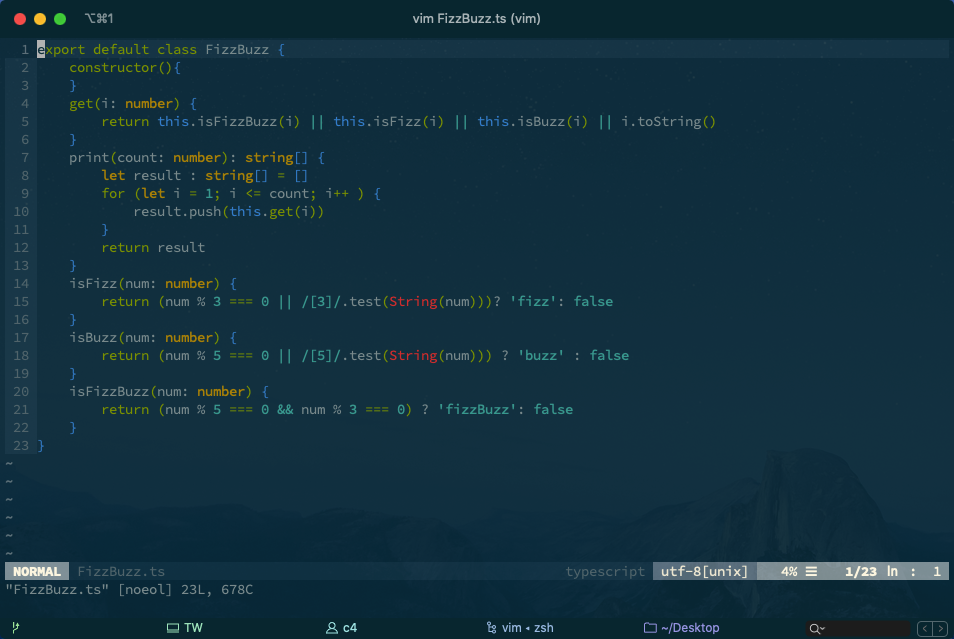

# .vim

## 效果



## 安装

```shell
$ git clone --depth=1 --recursive git@github.com:guzhongren/.vim.git ~/.vim
...
```

## 添加

```shell
$ git submodule add https://github.com/w0rp/ale.git ~/.vim/pack/default/start/ale
...
# 或者
$ git submodule add git@github.com:lilydjwg/fcitx.vim.git ~/.vim/pack/default/start/citx.vim
...
```

## 更新

```shell
$ git submodule update --recursive --remote --depth=1
...
```
